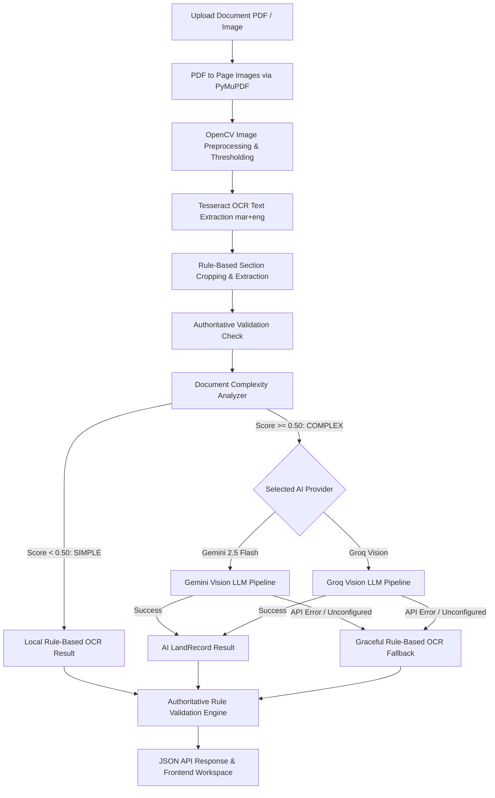

# BhuLekha (भूलेख)

**Intelligent 7/12 Land Record Digitization, Complexity Routing & Authoritative Verification Platform**

BhuLekha is an AI-powered land-record digitization and validation platform designed to extract structured information from scanned Maharashtra 7/12 (सातबारा) land records and other complex documents.


---

## 📌 Project Overview

Scanned government land records, particularly Maharashtra 7/12 (सातबारा) extracts, present significant digitization challenges due to:
- **Devanagari / Marathi script** requiring specialized OCR and encoding preservation.
- **Low-resolution scans and noise** from physical document wear, stamps, or watermarks.
- **Multi-region table layouts** separating header metadata, ownership rights, and crop details.
- **Complex co-ownership structures** and irregular survey/khasra land identifiers.

BhuLekha solves these challenges through a hybrid architecture combining local deterministic computer vision and OCR preprocessing with an **explainable document complexity routing engine**. Simple documents are processed entirely locally with **0 AI API calls**, while complex documents are dynamically routed to **Gemini 2.5 Flash** (or **Groq Vision**). All extractions are passed through an authoritative rule-based validation engine before being presented in an interactive verification workspace.

---

## ✨ Key Features

- 📄 **Document Upload**: Supports PDF documents, PNG, JPG, and JPEG images.
- 🔤 **Marathi Devanagari Preservation**: Full Unicode text extraction preserving Marathi land record terms (`बीड`, `अंबाजोगाई`, `विलासराव पाटील`, `0.24.00`).
- ✂️ **Automatic Region & Section Cropping**: Uses OpenCV layout algorithms to isolate headers (`record_header.png`), owner rights (`owner_rights.png`), and crop tables (`crop_table.png`).
- 🎯 **Structured Field Extraction**: Extracts key 7/12 land metrics:
  - **District (`जिल्हा`)**
  - **Taluka / Tehsil (`तालुका`)**
  - **Village (`गाव`)**
  - **Survey Number (`गट क्रमांक`)**
  - **Owner Name (`खातेदाराचे नाव`)**
  - **Land Holding Type (`धारण प्रकार`)**
  - **Area (`क्षेत्रफल`)**
- 🧠 **Explainable Complexity Detection**: Evaluates field completeness, validation warnings, table line density, owner structure, and text density to classify documents as `simple` or `complex`.
- 🔀 **Intelligent Hybrid AI Routing**:
  - `simple` ➔ Local Tesseract OCR & Rule Engine (0 AI cost).
  - `complex` ➔ Gemini 2.5 Flash Multimodal Vision Pipeline.
  - Optional / Fallback Provider ➔ Groq Vision (`meta-llama/llama-4-scout-17b-16e-instruct`).
- 🛡️ **Authoritative Rule Validation**:
  - District / Taluka / Village location hierarchy verification against Maharashtra reference datasets.
  - Survey number regex pattern matching (`312/2`, `124/3A`).
  - Land area format validation and cross-field consistency checking.
- 🛡️ **Non-Destructive Degradation**: Automatically falls back to rule-based local OCR if AI services encounter missing API keys, rate limits, or network timeouts.
- 💻 **Interactive Verification Workspace**: React/Vite web interface featuring side-by-side document inspection, field status badges (`accepted`, `edited`, `rejected`, `needs_review`), keyboard shortcuts (`A`, `E`, `R`), and AI provider selection.

---

## 🏛️ AI-Powered Hybrid Extraction Architecture



### 1. Simple Documents (`score < 0.50`)
Documents with clear headers, standard single-owner formats, and complete OCR text are classified as `simple`. They are processed entirely locally using OpenCV preprocessing, Tesseract OCR, and deterministic rule matching. **No AI API calls are consumed.**

### 2. Complex Documents (`score >= 0.50`)
Documents with missing fields, dense multi-owner tables, severe scan noise, or validation warnings are classified as `complex`. They are routed to a multimodal vision LLM:
- **Primary AI Provider**: **Gemini 2.5 Flash** (`gemini-2.5-flash`), supporting direct PDF and high-resolution image analysis.
- **Secondary / Fallback Provider**: **Groq Vision** (`meta-llama/llama-4-scout-17b-16e-instruct`).

### 3. Graceful Fallback
If an AI provider request fails due to missing credentials (`GEMINI_API_KEY` unconfigured), rate limits (HTTP 429), or service unavailability (HTTP 503), the backend automatically falls back to local rule-based OCR (`source: "rule_based_ocr_fallback"`), ensuring zero system downtime.

---

## 📊 Why Complexity Detection Exists

The document complexity analyzer ([`document_complexity_service.py`](file:///home/pranavms09/Hackathons/BhuLekha/backend/app/services/document_complexity_service.py)) evaluates five local signals to prevent unnecessary API spending and latency:

1. **Field Completeness**: Ratio of required land fields successfully parsed by local OCR rules.
2. **Validation Warnings**: Count of errors or warnings returned by `validation_service.py`.
3. **Table Line & Layout Density**: Density of structural table borders and section grid lines.
4. **Owner Complexity**: Presence of multiple co-owners, legal notes, or complex text blocks.
5. **OCR Text Quality**: Ratio of unreadable characters and text fragment noise.

$$\text{Complexity Score} \in [0.0, 1.0]$$

$$\text{Route} = \begin{cases} \text{Local OCR (Simple)}, & \text{Score} < 0.50 \\ \text{AI Vision LLM (Complex)}, & \text{Score} \ge 0.50 \end{cases}$$

---

## 📋 Extraction Schema

The API outputs a structured `LandRecord` schema paired with field-level confidence scores and validation diagnostic metadata:

```json
{
  "message": "Document processed successfully",
  "document_id": "8f3b2a1c-9e4d-4f12-8a90-b1c2d3e4f5a6",
  "filename": "7_12_Sample_Beed.pdf",
  "record": {
    "district": { "value": "बीड", "confidence": 0.95 },
    "taluka": { "value": "अंबाजोगाई", "confidence": 0.95 },
    "village": { "value": "अंबाजोगाई (रुरल)", "confidence": 0.95 },
    "survey_number": { "value": "312/2", "confidence": 0.90 },
    "owner_name": { "value": "विलासराव पाटील", "confidence": 0.90 },
    "land_holding_type": { "value": "भोगवटदार वर्ग - १", "confidence": 0.90 },
    "area": { "value": "0.24.00", "confidence": 0.85 }
  },
  "validation": {
    "status": "valid",
    "message": "All land record fields passed authoritative validation.",
    "fields": {
      "location_hierarchy": { "status": "valid", "reasons": [] },
      "survey_number": { "status": "valid", "reasons": [] },
      "area_format": { "status": "valid", "reasons": [] }
    }
  },
  "extraction": {
    "source": "gemini_vision",
    "route": "gemini"
  },
  "complexity": {
    "classification": "complex",
    "score": 0.65,
    "threshold": 0.50,
    "reasons": ["Multiple owner names detected in section", "Validation warning on area metric format"]
  }
}
```
*Note: The snippet above is an illustrative schema example for evaluation purposes.*

---

## 🛡️ Validation Architecture

In BhuLekha, **AI extractions are never automatically trusted**. Extracted records pass through the authoritative validation engine ([`validation_service.py`](file:///home/pranavms09/Hackathons/BhuLekha/backend/app/services/validation_service.py)):

- **AI Confidence Score**: Measures model statistical certainty (e.g. `0.95`).
- **Authoritative Rule Validation**: Checks logical domain rules:
  - *Does the village belong to the specified Taluka and District in the reference database?*
  - *Does the survey number conform to Maharashtra land record numbering standards?*
  - *Is the land area formatted correctly in Hectare-Acre-Guntha notation?*

> [!IMPORTANT]
> **Core Principle**: High AI confidence (`0.99`) **cannot override** a validation error (`invalid_location_hierarchy`). If validation fails, the record is flagged as `needs_review` for human verification.

---

## 🔑 AI Provider Configuration

### 1. Gemini 2.5 Flash (Primary Provider)
BhuLekha uses **Gemini 2.5 Flash** (`gemini-2.5-flash`) for complex document extraction. Configure credentials in `backend/.env`:

```env
GEMINI_API_KEY=your_gemini_api_key_here
GEMINI_MODEL=gemini-2.5-flash
PRIMARY_AI_PROVIDER=gemini
```

### 2. Groq Vision (Secondary / Fallback Provider)
Groq Vision (`meta-llama/llama-4-scout-17b-16e-instruct`) is supported as an optional secondary provider or fallback:

```env
GROQ_API_KEY=your_groq_api_key_here
GROQ_VISION_MODEL=meta-llama/llama-4-scout-17b-16e-instruct
```

---

## 💻 Tech Stack

| Layer | Technology | Purpose |
|---|---|---|
| **Frontend Framework** | React 19 + TypeScript | Interactive single-page UI |
| **Frontend Build Tool** | Vite 6 | Fast HMR development and bundling |
| **Icons & Animations** | Lucide React + Framer Motion | Modern design tokens & UI motion |
| **Backend Framework** | FastAPI | High-performance async Python REST API |
| **Language** | Python 3.12 | Backend core logic |
| **ASGI Server** | Uvicorn | ASGI server implementation |
| **OCR Engine** | Tesseract OCR (`mar+eng`) | System-level optical character recognition |
| **PDF Processing** | PyMuPDF (`fitz`) | High-resolution PDF page rendering |
| **Image Preprocessing** | OpenCV (`cv2`) + Pillow | Adaptive thresholding, denoising, cropping |
| **Primary AI Vision** | Google Gemini 2.5 Flash (`google-genai`) | Multimodal LLM extraction |
| **Secondary AI Vision** | Groq Vision (`groq`) | Alternative vision LLM provider |
| **Validation Engine** | Pydantic 2 + Custom Services | Authoritative rule-based verification |

---

## 📁 Repository Structure

```
BhuLekha/
├── backend/
│   ├── app/
│   │   ├── api/
│   │   │   ├── upload.py                 # POST /api/upload endpoint
│   │   │   └── process.py                # POST /api/process pipeline router
│   │   ├── models/
│   │   │   └── land_record.py            # LandRecord Pydantic schema
│   │   ├── services/
│   │   │   ├── document_processor.py     # PyMuPDF PDF rendering & OpenCV preprocessing
│   │   │   ├── ocr_service.py            # Tesseract mar+eng text extraction
│   │   │   ├── land_record_extractor.py  # Local rule-based field parsing
│   │   │   ├── validation_service.py     # Authoritative location & field rules
│   │   │   ├── reference_service.py      # Maharashtra location lookup tables
│   │   │   ├── consistency_service.py    # Cross-field consistency checks
│   │   │   ├── document_complexity_service.py # 5-signal complexity scoring
│   │   │   ├── extraction_router.py      # Route execution engine (OCR vs AI)
│   │   │   ├── gemini_service.py         # Gemini 2.5 Flash SDK service
│   │   │   ├── gemini_vision_extractor.py# Gemini structured extraction prompt adapter
│   │   │   ├── groq_service.py           # Groq Vision SDK service
│   │   │   ├── vision_extractor.py       # Groq vision prompt adapter
│   │   │   └── ai_validation_service.py  # AI response adapter to LandRecord
│   │   ├── config.py                     # Centralized environment variable loader
│   │   └── main.py                       # FastAPI application entry point & CORS
│   ├── data/                             # Reference location hierarchies & NER samples
│   ├── tools/                            # NER dataset collection & evaluation tools
│   ├── run_all_tests.py                  # Master backend test suite
│   ├── requirements.txt                  # Python dependencies
│   └── .env.example                      # Backend environment template
│
├── frontend/
│   ├── src/
│   │   ├── components/                   # Navigation shell, copilot, toast notifications
│   │   ├── pages/                        # Documents, Verification, Records, GIS, Analytics
│   │   ├── services/
│   │   │   └── api.ts                    # Backend API client integration
│   │   ├── lib/
│   │   │   └── AppContext.tsx            # Global state context
│   │   ├── App.tsx                       # React Router configuration
│   │   └── main.tsx                      # Application mount entry point
│   ├── package.json                      # Node dependencies & build scripts
│   ├── package-lock.json                 # Dependency lockfile
│   └── .env.example                      # Frontend environment template
│
├── .gitignore                            # Excludes venv, node_modules, .env, uploads
└── README.md                             # Repository documentation
```

---

## 🚀 Local Development Setup

Follow these instructions to run BhuLekha on a fresh Linux machine.

### Prerequisites
- **Linux OS** (Ubuntu 20.04+ / Debian recommended)
- **Python 3.10+** (Python 3.12 verified)
- **Node.js 18+** & `npm`

---

### Step 1 — Clone the Repository

```bash
git clone https://github.com/Pranavms09/SIH-26.git
cd BhuLekha
```

---

### Step 2 — Install System OCR Prerequisites

BhuLekha requires system-level Tesseract OCR with English and Marathi language packs:

```bash
sudo apt update
sudo apt install -y tesseract-ocr tesseract-ocr-mar
```

Verify Tesseract installation:
```bash
tesseract --version
tesseract --list-langs | grep -E "eng|mar"
```

---

### Step 3 — Backend Setup

```bash
cd backend

# Create & activate Python virtual environment
python3 -m venv venv
source venv/bin/activate

# Install backend Python dependencies
pip install -r requirements.txt

# Configure environment variables
cp .env.example .env
```

Edit `backend/.env` to configure your API key:
```env
GEMINI_API_KEY=your_gemini_api_key_here
GEMINI_MODEL=gemini-2.5-flash
PRIMARY_AI_PROVIDER=gemini
```

#### Start Backend API Server:
```bash
python -m uvicorn app.main:app --reload --host 127.0.0.1 --port 8000
```

- **Backend API Base**: `http://127.0.0.1:8000`
- **Swagger Documentation**: `http://127.0.0.1:8000/docs`
- **Health Check**: `http://127.0.0.1:8000/health`

---

### Step 4 — Frontend Setup

Open a second terminal window:

```bash
cd BhuLekha/frontend

# Install Node dependencies
npm install

# Configure environment variables
cp .env.example .env

# Start Frontend Development Server
npm run dev
```

- **Frontend Application URL**: `http://localhost:5173`

---

## ⚙️ Environment Variables

| Variable | Location | Required | Purpose | Default |
|---|---|---|---|---|
| `GEMINI_API_KEY` | `backend/.env` | Optional | API key for Gemini 2.5 Flash AI vision processing | `""` |
| `GEMINI_MODEL` | `backend/.env` | Optional | Gemini model identifier | `gemini-2.5-flash` |
| `GROQ_API_KEY` | `backend/.env` | Optional | API key for Groq Vision fallback provider | `""` |
| `GROQ_VISION_MODEL` | `backend/.env` | Optional | Groq Vision model identifier | `meta-llama/llama-4-scout-17b-16e-instruct` |
| `PRIMARY_AI_PROVIDER` | `backend/.env` | Optional | Preferred AI vision provider (`gemini` or `groq`) | `gemini` |
| `VITE_API_BASE_URL` | `frontend/.env` | Yes | Backend API base URL for frontend HTTP client | `http://127.0.0.1:8000` |

---

## 📡 API Documentation

### 1. `POST /api/upload`
Uploads a document file to the backend without processing.

- **Parameters**: `file` (Multipart File: `.pdf`, `.jpg`, `.jpeg`, `.png`)
- **Response**:
  ```json
  {
    "message": "Document uploaded successfully",
    "original_filename": "sample_712.pdf",
    "saved_filename": "a1b2c3d4.pdf",
    "file_path": "uploads/a1b2c3d4.pdf"
  }
  ```

### 2. `POST /api/process`
Executes the end-to-end extraction, complexity routing, AI vision, and validation pipeline.

- **Query Parameter**: `provider` (Optional string: `"gemini"`, `"groq"`, or `"ocr"`)
- **Body**: `file` (Multipart Form File)
- **Response**: Full `ProcessResponse` JSON containing `pages`, `record`, `validation`, `extraction`, and `complexity`.

### 3. `GET /health`
Returns backend service health status.
- **Response**: `{"status": "healthy"}`

---

## 🌐 Swagger / OpenAPI Interactive Testing

FastAPI automatically serves interactive API documentation:

1. Start backend server (`python -m uvicorn app.main:app --reload --port 8000`).
2. Open `http://127.0.0.1:8000/docs` in your browser.
3. Click `POST /api/process`.
4. Click **Try it out**.
5. Select a PDF or image document in the `file` parameter field.
6. (Optional) Set `provider` to `gemini` or `groq`.
7. Click **Execute** and review the structured extraction JSON payload.

---

## 🖥️ Frontend Workflow

1. Navigate to `http://localhost:5173`.
2. The top bar displays live backend connectivity status (**Backend Online**).
3. Select preferred **AI Provider Route** (`Gemini 2.5 Flash`, `Groq Vision`, or `Local OCR`).
4. Drag and drop a scanned 7/12 land record PDF or image into the drop zone.
5. Click **Start Processing**.
6. The app uploads the document, tracks backend extraction stages, and navigates to `/app/verification`.
7. Inspect the document layout side-by-side with extracted Devanagari fields, confidence scores, and authoritative validation warnings.
8. Accept (`A`), Edit (`E`), or Reject (`R`) fields interactively using keyboard shortcuts.

---

## 🧪 Testing

Run the master test suite covering all 17 backend modules:

```bash
cd backend
source venv/bin/activate
python run_all_tests.py
```

### Test Strategy:
- **Offline Unit Tests**: All regular unit tests (`test_gemini_integration.py`, `test_groq_service.py`, `test_ai_validation.py`, `test_document_complexity.py`, `test_extraction_router.py`) mock external AI APIs. They execute cleanly **without consuming API quota** or requiring live network access.
- **Live Integration Tests** (Optional): Scripts named `test_*_live.py` (e.g. `test_gemini_connection.py`, `test_groq_connection.py`, `test_api_hybrid_live.py`) test live API connectivity when `GEMINI_API_KEY` or `GROQ_API_KEY` is present.

---

## 🔒 Security

> [!WARNING]
> **Never commit API keys or `.env` files to version control.**

- **Server-Side API Credentials**: `GEMINI_API_KEY` and `GROQ_API_KEY` are accessed exclusively by backend services. API keys are never bundled into frontend assets or sent to client browsers.
- **Git Protections**: Root [.gitignore](file:///home/pranavms09/Hackathons/BhuLekha/.gitignore) explicitly excludes `.env`, `venv/`, `node_modules/`, `dist/`, uploaded documents in `uploads/`, and temporary processing caches.

---

## 🔒 Data Privacy

- **Local Storage**: Uploaded files and processing artifacts remain strictly in `backend/uploads/processed/` on the local server filesystem.
- **No Persistence to Public Cloud**: Documents are sent to AI vision APIs (Gemini/Groq) over encrypted HTTPS for ephemeral inference only when routed to complex mode.
- **Local OCR Privacy**: Simple documents stay 100% local and are never transmitted over the internet.

---

## ⚠️ Current Limitations

- **Scan Quality**: Low-resolution scans (< 150 DPI) or severely blurred documents reduce Tesseract OCR accuracy.
- **Handwritten Annotations**: Heavily distorted handwritten cursive annotations on physical land records may require human review in the verification workspace.
- **AI Internet Requirement**: Complex documents routed to Gemini 2.5 Flash or Groq Vision require an active internet connection.
- **Quota Limits**: Free-tier Gemini or Groq API keys may be subject to provider rate limits (HTTP 429).

---

## 🎯 Architectural Design Principles

1. **Local-First Processing**: Simple documents consume 0 API credits.
2. **AI as an Accelerator, Not an Oracle**: AI outputs are validated against authoritative rules.
3. **Authoritative Rule Dominance**: High AI confidence score cannot override domain rule validation errors.
4. **Zero Value Mutation**: Raw extraction provenance is preserved alongside validation suggestions.
5. **Non-Destructive Degradation**: System continues operating via local OCR fallback even when external APIs fail.

---

## 💡 Troubleshooting

### `ModuleNotFoundError`
Ensure your virtual environment is active and dependencies are installed:
```bash
source backend/venv/bin/activate
pip install -r requirements.txt
```

### Gemini API Not Configured
If `GEMINI_API_KEY` is unconfigured, BhuLekha automatically displays a warning toast in the frontend and falls back to local OCR processing without crashing.

### Frontend Cannot Connect to Backend
- Ensure backend server is running on `http://127.0.0.1:8000`.
- Verify `VITE_API_BASE_URL=http://127.0.0.1:8000` in `frontend/.env`.

### Tesseract Not Found
Install system Tesseract OCR:
```bash
sudo apt update && sudo apt install -y tesseract-ocr tesseract-ocr-mar
```

### Port 8000 or 5173 Already in Use
Specify alternative ports:
```bash
# Backend
python -m uvicorn app.main:app --port 8001

# Frontend
npm run dev -- --port 5174
```

---

## 🤝 Contributing

1. Fork the repository & create a feature branch (`git checkout -b feature/improvement`).
2. Make your changes adhering to existing code conventions.
3. Run `python run_all_tests.py` and `npm run build` to verify tests pass.
4. Confirm no `.env` files or credentials are tracked (`git status`).
5. Submit a pull request.

---

## 📜 License

Licensing has not yet been specified for this repository.
